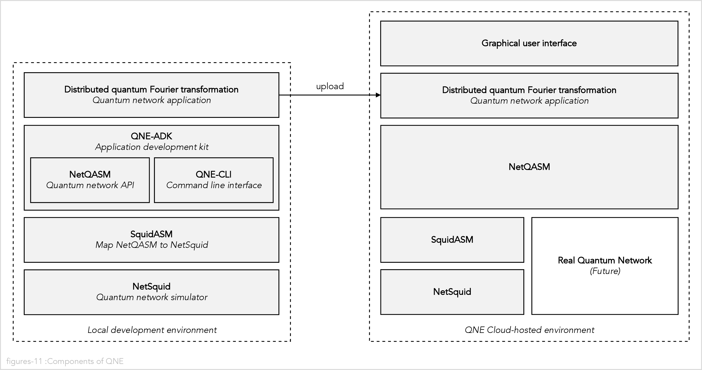

# The distributed quantum Fourier transformation (DQFT) implementation in QNE-ADK

In this section we describe our implementation of the distributed quantum Fourier transformation
in the Quantum Network Explorer Application Development Kit (QNE-ADK).

## What is QNE-ADK

The
[Quantum Network Explorer (QNE)](https://www.quantum-network.com/)
is a website that teaches the fundamentals of quantum networking.
It is published by
[QuTech](https://qutech.nl/),
a world-leading research institute for quantum computing and the quantum Internet
based in the Netherlands.

In addition to tutorials, QNE also offers an
[Application Development Kit (ADK)](https://www.quantum-network.com/adk/)
which allows users to develop their own quantum network applications.

QNE-ADK uses NetQASM to provide the application programming interface (API) for quantum network
application developers. NetQASM is a Python module and the applications are developed in Python.

NetQASM is based on QASM, a family of assembly-level programming languages for
quantum computers.
[OpenQASM](https://github.com/openqasm/openqasm#readme) is one example of a language in this
family.

NetQASM extends QASM by also providing quantum networking primitives in addition to
quantum computing primitives.
One example of such an extension is a primitive to create entanglement between two nodes in
the network.

You can find information about NetQASM in:

-   ArXiv paper
    [NetQASM: A low-level instruction set architecture for hybrid quantum-classical programs in a quantum internet](https://arxiv.org/abs/2111.09823)
-   [The NetQASM GitHub repository](https://github.com/QuTech-Delft/netqasm)
-   [The NetQASM read-the-docs documentation page](https://netqasm.readthedocs.io/en/latest/).

QNE-ADK also provides a suite of command line tools to:

-   Manage the life cycle of quantum network applications.
-   Run applications locally on your computer.
-   Upload applications to the QNE-ADK cloud and run them there.
-   Publish quantum network applications on the
    [Community Application Library](https://www.youtube.com/watch?v=DTONkiX1bMU)
    and make them available to other users of QNE-ADK.

These command line tools are documented in the
[QNE-ADK user guide](https://www.quantum-network.com/knowledge-base/qne-quantum-application-development-kit-adk/).

Currently, QNE-ADK uses simulated quantum networks to run the applications.

According to the
[NetSquid documentation](https://github.com/QuTech-Delft/netqasm)
it is possible to use either
[NetSquid](https://netsquid.org/)
or
[SimulaQron](http://www.simulaqron.org/)
as the simulator backend, although it seems that NetSquid is much better supported than SimulaQron.
We only used the NetSquid backend.

You can find information about NetSquid in:

-   Nature paper
    [NetSquid, a NETwork Simulator for QUantum Information using Discrete events](https://www.nature.com/articles/s42005-021-00647-8).
-   [The NetSquid website](https://netsquid.org/).
-   [The NetSquid documentation](https://docs.netsquid.org/latest-release/)
    (requires registration).

The mapping of the NetQASM API to the NetSquid simulation backend is open sourced in
GitHub repository
[QuTech-Delft/squidasm](https://github.com/QuTech-Delft/squidasm).

The
[Quantum Internet Alliance(QIA)](https://quantum-internet.team/)
is a collaboration between Europe’s leading quantum research institutes and industry actors
working to develop the quantum Internet.
They are in the process of building a metropolitan scale quantum networks containing quantum
processors and quantum repeaters.
Once that real quantum network is in place, the applications developed on QNE ADK will be able to
run on it.

The following figure shows the relationship between all of the components of QNE mentioned above:



# Running the distributed quantum Fourier transformation implemented in QNE-ADK

This is just a minimal place holder so that everyone can try running a basic QNE-ADK program.

I am assuming that the environment variable `QIH_2022_ROOT` is set to the
directory where we cloned our repositories (see the
[installation instructions](docs/installation.md)
for details).

Change the directory to the `quantum-internet-hackathon-2022/qne_adk` repository directory:

```
cd $QIH_2022_ROOT/quantum-internet-hackathon-2022
```

If you have not already activated your virtual environment do so now:

```
source venv/bin/activate
```

Change into the `qne_adk` directory:

```
cd qne_adk
```

Run the `qft` application (in this case I am including the output so that you know what to expect):

<pre>
$ <b>./run.sh qft</b>
Cleaning qft...
Running qft...
qne experiment create qft_experiment qft randstad
Experiment run successfully. Check the results using command 'experiment results'
Results:
[
  {
    "app_qft": {
      "n": 3,
      "value": 1
    }
  }
]
Logs:
qft_app_log.yaml:
  LOG: qft starts
  LOG: n=3
  LOG: value=1
  LOG: qft creates register of 3 qubits
  LOG: apply qft
  LOG: apply qft value n=3 value=1
  LOG: bit 0 = 1
  LOG: X gate qubit 0
  LOG: bit 1 = 0
  LOG: bit 2 = 0
  LOG: apply qft rotations n=3
  LOG: hadamard qubit 2
  LOG: controlled phase control qubit 0 and target qubit 2 by angle pi/4
  LOG: controlled phase control qubit 1 and target qubit 2 by angle pi/2
  LOG: apply qft rotations n=2
  LOG: hadamard qubit 1
  LOG: controlled phase control qubit 0 and target qubit 1 by angle pi/2
  LOG: apply qft rotations n=1
  LOG: hadamard qubit 0
  LOG: apply qft swaps
  LOG: swap qubit 0 with qubit 2 (XXX not implemented)
  LOG: "density matrix for qubit 2 = [[ 1.25000000e-01+0.j          8.83883476e-02-0.08838835j\n
    \ -1.25000000e-01+0.j         -8.83883476e-02+0.08838835j\n   2.08166817e-17-0.125j
    \     -8.83883476e-02-0.08838835j\n  -2.08166817e-17+0.125j       8.83883476e-02+0.08838835j]\n
    [ 8.83883476e-02+0.08838835j  1.25000000e-01+0.j\n  -8.83883476e-02-0.08838835j
    -1.25000000e-01+0.j\n   8.83883476e-02-0.08838835j  2.08166817e-17-0.125j\n  -8.83883476e-02+0.08838835j
    -2.08166817e-17+0.125j     ]\n [-1.25000000e-01+0.j         -8.83883476e-02+0.08838835j\n
    \  1.25000000e-01+0.j          8.83883476e-02-0.08838835j\n  -2.08166817e-17+0.125j
    \      8.83883476e-02+0.08838835j\n   2.08166817e-17-0.125j      -8.83883476e-02-0.08838835j]\n
    [-8.83883476e-02-0.08838835j -1.25000000e-01+0.j\n   8.83883476e-02+0.08838835j
    \ 1.25000000e-01+0.j\n  -8.83883476e-02+0.08838835j -2.08166817e-17+0.125j\n   8.83883476e-02-0.08838835j
    \ 2.08166817e-17-0.125j     ]\n [ 2.08166817e-17+0.125j       8.83883476e-02+0.08838835j\n
    \ -2.08166817e-17-0.125j      -8.83883476e-02-0.08838835j\n   1.25000000e-01+0.j
    \         8.83883476e-02-0.08838835j\n  -1.25000000e-01+0.j         -8.83883476e-02+0.08838835j]\n
    [-8.83883476e-02+0.08838835j  2.08166817e-17+0.125j\n   8.83883476e-02-0.08838835j
    -2.08166817e-17-0.125j\n   8.83883476e-02+0.08838835j  1.25000000e-01+0.j\n  -8.83883476e-02-0.08838835j
    -1.25000000e-01+0.j        ]\n [-2.08166817e-17-0.125j      -8.83883476e-02-0.08838835j\n
    \  2.08166817e-17+0.125j       8.83883476e-02+0.08838835j\n  -1.25000000e-01+0.j
    \        -8.83883476e-02+0.08838835j\n   1.25000000e-01+0.j          8.83883476e-02-0.08838835j]\n
    [ 8.83883476e-02-0.08838835j -2.08166817e-17-0.125j\n  -8.83883476e-02+0.08838835j
    \ 2.08166817e-17+0.125j\n  -8.83883476e-02-0.08838835j -1.25000000e-01+0.j\n   8.83883476e-02+0.08838835j
    \ 1.25000000e-01+0.j        ]]"
  LOG: writing density matrix to qne_dm.txt
  LOG: qft ends
</pre>
