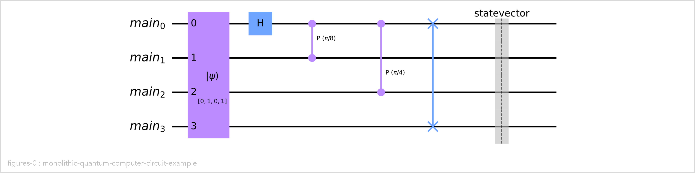
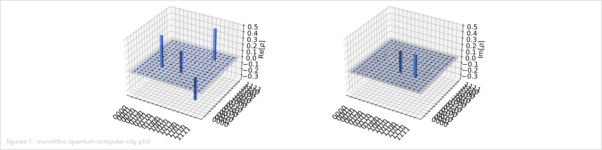
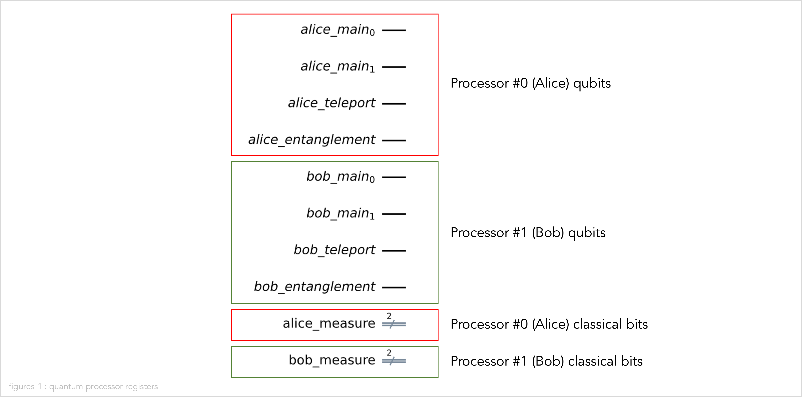
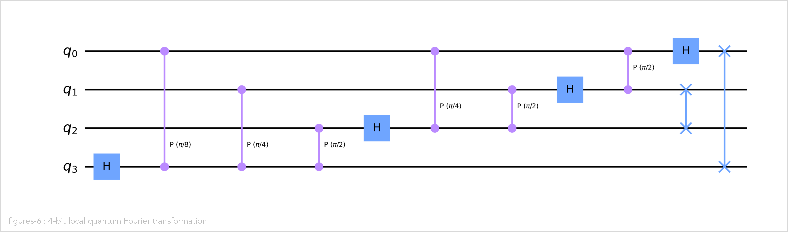
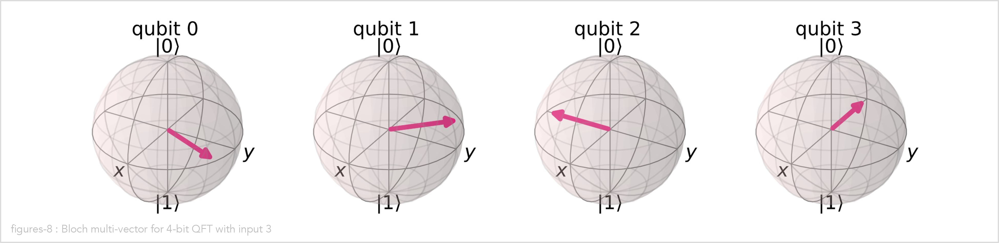
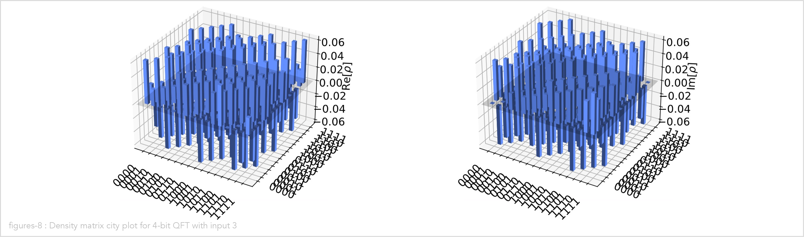

# The distributed quantum Fourier transformation (DQFT) implementation in Qiskit

In this section we describe the implementation of the distributed quantum Fourier transformation
in Qiskit.

## What is Qiskit?

[Qiskit](https://qiskit.org/) is an open-source software development kit (SDK) for working with
quantum computers at the level of pulses, circuits, and application modules.
We use the following two
[elements](https://qiskit.org/documentation/stable/0.24/the_elements.html)
of Qiskit:

-   [Qiskit Terra](https://github.com/Qiskit/qiskit-terra),
    the core component of Qiskit, which contains the building blocks for creating and working with
    quantum circuits, programs, and algorithms.

-   [Qiskit Aer](https://github.com/Qiskit/qiskit-aer)
    which provides high-performance quantum computing simulators with realistic noise models.

## Implementing the quantum Fourier transformation using Qiskit

We implement three different versions of the quantum Fourier transformation (QFT) using Qiskit:

1.  A monolithic (non-distributed) version of the quantum Fourier transformation.
    We use this as a reference to check whether the results of the two distributed versions
    are correct.

2.  A distributed version of the quantum Fourier transformation based on teleportation.

3.  A distributed version of the quantum Fourier transformation based on cat states.

## Installation instructions

Follow
[these installation instructions](installation.md)
to install the quantum Fourier transformation implementations, Qiskit, and other dependencies.

## Directory structure

The Qiskit implementation of the distributed quantum Fourier transformation is stored in the
[`qiskit`](../qiskit/) subdirectory of this repository.

There are Python modules that implement abstractions of quantum computers on which to run the
quantum Fourier transformation algorithm.
The class `MonolithicQuantumComputer` abstracts a monolithic (non-distributed) quantum computer.
The class `ClusteredQuantumComputer` abstracts a clustered (distributed) quantum computer.

| File                | Function                                                                      |
| ------------------- | ----------------------------------------------------------------------------- |
| quantum_computer.py | Implements classes `MonolithicQuantumComputer` and `ClusteredQuantumComputer` |
| utils.py            | Common utilities                                                              |
| examples.py         | Implements examples that are used in the demonstration Jupyter notebooks      |

There are Python modules that implement the three flavors of quantum Fourier transformation.

| File        | Function                                                                    |
| ----------- | --------------------------------------------------------------------------- |
| qft.py      | Implements classes `QFT` (non-distributed QFT) and `DQFT` (distributed QFT) |
| test_qft.py | Unit tests for `qft.py`                                                     |

There are also Jupyter notebooks to demonstrate the code.defines the operations

| File                              | Function                                                        |
| --------------------------------- | --------------------------------------------------------------- |
| monolithic_quantum_computer.ipynb | Demonstrates class `MonolithicQuantumComputer`                  |
| clustered_quantum_computer.ipynb  | Demonstrates class `DistributedQuantumComputer`                 |
| qft.ipynb                         | Demonstrates class `QFT`                                        |
| teleport_distributed_qft.ipynb    | Demonstrates class `DQFT` using teleportation                   |
| cat_state_distributed_qft.ipynb   | Demonstrates class `DQFT` using cat states                      |
| density_matrices.ipynb            | Some basic examples of density matrices                         |
| just_crotz.ipynb                  | Some basic examples of controlled rotation-Z                    |
| find_period.ipynb                 | An example quantum circuit for finding the period of a function |

## Classes that model quantum computers

Python module `quantum_computer.py` defines three classes that model quantum computers:

-   Class `QuantumComputer` is an abstract base class that defines the common interface and
    behavior for the following two types of quantum computers.

-   Class `MonolithicQuantumComputer` models a monolithic (i.e. non-distributed) quantum computer.

-   Class `ClusteredQuantumComputer` models a distributed quantum computer. It is implemented as a
    cluster of processors connected by a entanglement-based quantum network. Each processor in the
    cluster is modeled by the `ProcessorInClusteredQuantumComputer` class.

## Abstract base class `QuantumComputer`

The base class `QuantumComputer` defines the abstract operations that are used to implement a
quantum algorithm. The table below lists the set of operations that is currently supported
(these are all we need for implementing quantum Fourier transformations, but more operations can
easily be added for other algorithms):

| Function              | Description                                                    |
| --------------------- | -------------------------------------------------------------- |
| `hadamard`            | Perform a Hadamard gate on one qubit in the circuit            |
| `controlled_phase`    | Perform a controlled-phase gate on two qubits in the circuit   |
| `swap`                | Perform a swap gate on two qubits in the circuit               |
| `set_input_number`    | Set the input of the circuit to a numeric value                |
| `run`                 | Run the circuit                                                |
| `circuit_diagram`     | Display the circuit diagram                                    |
| `statevector_data`    | Return the circuit output statevector                          |
| `statevector_latex`   | Display the circuit output statevector using LaTeX             |
| `bloch_multivector`   | Display the circuit output state as a Bloch multivector        |
| `density_matrix_city` | Display the circuit output state as a density matrix city plot |

## Class `MonolithicQuantumComputer`

The class `MonolithicQuantumComputer` models a monolithic (i.e. non-distributed) quantum computer.

Under the hood, the implementation of `MonolithicQuantumComputer` does a simple one-to-one mapping
of logical qubits to underlying concrete qubits.

Create an instance of a monolithic quantum computer:

```python
computer = MonolithicQuantumComputer(total_nr_qubits)
```

Add a few gates to the circuit:

```python
computer.hadamard(0)
computer.controlled_phase(pi/8, 0, 1)
computer.controlled_phase(pi/4, 0, 2)
computer.swap(0, 3)
```

Run the circuit with input value 5 (binary 0101):

```python
computer.run(input_number=5)
```

Display the circuit. Here we can see that the operations on the logical qubits are mapped one-to-one
to operations on the underlying concrete qubits:

```python
display(computer.circuit_diagram(with_input=True))
```



Display the output density matrix of the circuit as a city plot:

```python
computer.density_matrix_city()
```



The Jupyter notebook `monolithic_quantum_computer.ipynb` contains a more detailed example
of how to use the class `MonolithicQuantumComputer`.

## Class `ClusteredQuantumComputer`

The class `ClusteredQuantumComputer` models a clustered (i.e. distributed) quantum computer.

The clustered quantum computer consists of several processors connected by an entanglement-based
quantum network.

The `ClusteredQuantumComputer` takes the following parameters:

-   `nr_processors`: The number of quantum processors in the cluster.

-   `total_nr_qubits`: The total number of main qubits in the cluster. This must be a multiple of
    `nr_processors`.

-   `method`: The method that is used to implement distributed controlled-unitary gates, either
    `Method.TELEPORT` or `Method.CAT_STATE`

Each processor in the cluster is modeled by a `ProcessorInClusteredQuantumComputer` object.

Each processor has the following qubits and classical bits:

-   The **main** qubits store the state for the quantum algorithm.

-   The **ancillary** qubits are used for quantum communication between the processors:

    -   The **entanglement** qubit holds one half of an entanglement with another processor.
        The entanglement is used to teleport another qubit or to entangle a cat state.

    -   The **teleport** qubit is used to temporarily store the sent or received qubit during
        teleportation.

-   The classical **measurement** bits are used to measured classical bits during teleportation,
    cat state entanglement, or cat state dis-entanglement.

In the following example we have a clustered quantum computer with two processors (Alice and Bob).
There is a total of 4 main qubits, 2 on each of the processors. Each processor also has some
ancillary qubits and classical bits for communication.



> > >

To the algorithm, the class `ClusteredQuantumComputer` provides the illusion that the clustered
quantum computer has a set of logical qubits, indexed 0 thru `total_nr_qubits`-1. The algorithm
can perform a single-qubit gate on any logical qubit and a two-qubit gate on any pair of logical
qubits.

Under the hood, the qubits are actually distributed across the multiple processors. For the sake of
this explanation we will call these concrete qubits.

When the algorithm performs a gate operation on one or two logical qubits, it is the job of
the `ClusteredQuantumComputer` class is to map the logical qubits to the underlying concrete
qubit and then to perform the operation on those underlying concrete qubits. In the Python
code this is called mapping the global qubit index to a local qubit index.

The details of how this mapping takes place are as follows:

-   For single-qubit operations (e.g. `hadamard`) the mapping figures out which physical qubit on
    which physical processor the logical qubit maps to, and performs the single-qubit operation on
    that physical qubit.

-   For two-qubit operations (e.g. `controlled_phase` and `swap`) there are multiple steps:

    -   First the mapping determines whether both involved logical qubits map to the same processor
        or to different processors.

    -   If the two logical qubits map to the same processor, the two-qubit operation is executed
        locally on that processor, using the two physical qubits that the two logical qubits map to.

    -   If the two logical qubits map to different processors, we use either teleportation or cat
        states to implement the two qubit operation remotely. For controlled-unitary (e.g.
        controlled-phase) operations, the `method` parameter for the `ClusteredQuantumComputer`
        constructor determines whether teleportation or cat states are used. For remote swap gates,
        we always use teleportation.

    -   When using teleportation to implement a two qubit operation, we first use teleportation
        to teleport one qubit to the processor where the other qubit is located (at this point both
        qubits are on the same processor), then we perform the two qubit operation locally on that
        processor, and then we teleport the first qubit back to its original location.

    -   When using cat states to implement a two qubit controlled-unitary operation, we first
        create a cat state to create an entangled control qubit on the same processor as the
        target processor, then we perform the controlled unitary operational locally on that
        processor, and then we dis-entangle the control qubit.

## The non-distributed (local) implementation of the quantum Fourier transformation

The file
[`qft.py`](../qiskit/qft.py)
defines the class `QFT` which is our implementation of the non-distributed
(local) quantum Fourier transformation.

The `QFT` class uses the Qiskit SDK to generate the quantum circuit for the quantum Fourier
transformation and to run the generated circuit in the Qiskit Aer simulator.

The implementation of the `QFT` class is based on the example code in
[chapter 3.5: Quantum Fourier Transform](https://qiskit.org/textbook/ch-algorithms/quantum-fourier-transform.html)
in the
[Qiskit Textbook](https://qiskit.org/textbook/).
The main difference is that we have used a Python class instead of free-standing Python functions
to implement the functionality. This is a pattern that we also follow for the distributed
implementations.

When a `QFT` object is instantiated, the Qiskit circuit for computing the quantum Fourier
transformation is generated.
The constructor of the `QFT` class takes two arguments:

-   `n` (integer): The size of the quantum Fourier transformation, i.e. the number of input qubits,
    which is equal to the number of output qubits.

-   `swaps` (boolean, default value False): Whether or not to perform the swap gate operations at the
    end of the quantum Fourier transformation.
    If swaps is True, we perform the swaps; if swaps is False (which is the default) we skip the
    swaps.
    It is customary to skip these final swap gates, because the same effect can be achieved by
    renumbering the qubits at the end of the algorithm.
    Also, QNE-ADK does not yet support the swap gates, we want to skip the final swap gates if we
    want to compare the Qiskit results with the QNE-ADK results.

The following example shows the quantum circuit that the `QFT` class generates for `n`=4 and
`swaps`=True:



The `run` member function of the `QFT` class executes the quantum Fourier transformation for a
specific input value. The `run` function takes two arguments:

-   `input` (integer): The input value for the quantum Fourier transformation. For example, if
    we have a 4-qubit QFT object (`n`=4) and the `input` value is 5, then the input for the quantum
    Fourier transformation is state |0101>.

-   `shots` (integer, default value 10000): How many times the Aer simulator should execute the
    QFT quantum circuit for the given input value to gather statistics for the output measurements.

Behind the scenes, the `run` method prepends some gates to the circuit to set the input qubits to
the desired values, runs the simulation the requested number of times, and stores the simulation
results in object member variables for later retrieval.

Finally, the `QFT` class provides several member functions that are intended to retrieve and
visualize the simulation results in a Jupyter notebook.

The following function can be run as soon as the `QFT` object has been instantiated, before the
`run` method has been invoked:

-   Function `circuit_diagram` displays a visual representation of the generated Qiskit circuit.

The following functions can be run after the `run` method has been invoked and summarize the
results of all circuit executions (all "shots"):

-   Function `density_matrix` returns the density matrix of the QFT output (averaged over all shots)
    as an array which is formatted for easy human reading.

-   Function `density_matrix_city` visualized the density matrix of the QFT output (averaged over all
    shots) as a "city diagram".

The following functions can be run after the `run` method has been invoked describe the state of
only the most recent circuit execution (shot):

-   Function `bloch_multivector` visualizes the density matrix of the QFT output as a Bloch
    multi-vector diagram
    (i.e. a group of Bloch spheres where arrows can be shorter than 1 to indicate entangled or
    mixed states).

-   Function `statevector` returns the statevector of the QFT output as a numpy array.

-   Function `statevector_latex` returns the statevector of the QFT output as a Latex vector.

For example, the following figure shows the Bloch multi-vector diagram for a 4-bit QFT with input 3:



The following figure shows the density matrix city plot for the same 4-bit QFT with input 3:



If you open the Jupyter notebook `qft.ipynb` and run it (e.g. using the Microsoft Jupyter
plugin for Visual Studio Code) you will see example outputs for all of the above functions.

## Processors and Clusters

We use the following terminology when implementing distributed versions of the quantum Fourier
transformation:

-   The term _processor_ refers to one individual quantum processor that participates in the
    distributed quantum Fourier transformation.

-   The term _cluster_ refers the collection of all processors that collectively perform
    the distributed quantum Fourier transformation.
    In other words, a cluster is group of processors.

Let's say we want to do a quantum Fourier transformation on an input of _N_ qubits.

-   In the non-distributed (local) implementation of the distribute quantum Fourier transformation
    we have a single processor that has _N_ input qubits and _N_ output qubits.

-   If we want to distribute the quantum Fourier transformation across _M_ processors:

    -   We have a single cluster.

    -   The cluster consists of _M_ processors.

    -   Each processor in the cluster has _N/M_ qubits that contain the input before the circuit is
        run and that contain the output after the circuit is run. We refer to these qubits as the main
        qubits.

    -   Each processor also contains two additional qubits that are used to communicate with other
        processors. We refer to these qubits as the entanglement qubit and the teleport qubit. Their
        roles are described in more detail below.

    -   Finally, each processor also contains two classical bits that are used to store the measurement
        results that are part of the teleportation procedure or cat-entangle / cat-disentangle
        procedure.

In real life, the processors in a cluster would be connected using some sort of quantum network.
The quantum network is used to generate entanglement between the processors.
That entanglement is used to teleport qubits or to create cat states to implement the distributed
computation.

## Modeling a cluster using one Qiskit circuit with multiple registers

In our Qiskit code, we model the entire cluster as one single quantum circuit.

Within that single quantum circuit, each processor is modelled as a set of registers:

-   There is a `main` quantum register containing _N/M_ qubits.

-   There is an `entanglement` quantum register containing 1 qubit.

-   There is a `teleport` quantum register containing 1 qubit.

-   There is a `measure` classical register containing 2 classical bits.

The following figure shows the quantum and classical registers that are generated for a cluster
that contains two processors:


## The cluster module

The Python module
[`cluster.py`](../qiskit/cluster.py)
defines the following base classes that are used for implementing various variations of
the distributed quantum Fourier transformation:

-   The base class `Processor` implements a single processor in a cluster.

-   The base class `Cluster` implements a cluster of processors.

The module also contains some example classes that are used in the
[`cluster.ipynb`](../qiskit/cluster.ipynb)
to illustrate the design of the `Processor` and `Cluster` classes.

## >>> The Cluster class

The intention of the `Cluster` class is to provide all of the functionality that is necessary to
implement all of the various flavors of the distributed quantum Fourier transformation, i.e. the
teleportation-based flavor and the cat-state-based flavor.

Behind the scenes, a `Cluster` object instantiates multiple `Processor` objects to represent each
of the processors in the cluster. However, the various flavors of the distributed quantum Fourier
transformation are not expected to interact with the `Processor` objects - they only interact with
the `Cluster` object.

The constructor for the `Cluster` class takes the following arguments:

-   `nr_processors` (integer): The number of processors in the cluster.

-   `total_nr_qubits` (integer): The total number of (main) qubits in the cluster. The cluster as
    a whole will be able to compute the Fourier transformation on `total_nr_qubits` qubits. The
    computation is distributed across all `nr_processors` processors. Each processor has
    `total_nr_qubits` / `nr_processor` main qubits (plus extra two qubits and two classical bits
    for computation).

Logically speaking, the cluster has a total of `total_nr_qubits` which are index from 0 to
`total_nr_qubits` - 1. We refer to this index as the _global index_ of the qubit.

Each of these logical qubits is physically located on one of the processors. We use the term
_local index_ to refer to the index of the qubit locally on the processor where it is located.

The following table shows an example to clarify the concept. Here we have 3 processors, each with
4 qubits, for a total of 12 qubits:

| Qubit global index | Processor index | Qubit local index |
| ------------------ | --------------- | ----------------- |
| 0                  | 0               | 0                 |
| 1                  | 0               | 1                 |
| 2                  | 0               | 2                 |
| 3                  | 0               | 3                 |
| 4                  | 1               | 0                 |
| 5                  | 1               | 1                 |
| 6                  | 1               | 2                 |
| 7                  | 1               | 3                 |
| 8                  | 2               | 0                 |
| 9                  | 2               | 1                 |
| 10                 | 2               | 2                 |
| 11                 | 2               | 3                 |

The `Cluster` class provides several methods to perform operations (e.g. one qubit gates or two
qubit gates) on the cluster as a whole.

-   `hadamard`: perform a Hadamard gate on a logical qubit in the cluster.

-   `controlled_phase`: perform a controlled-phase gate (also known as a controlled-rotation-Z gate)
    on two logical qubits in the cluster.

-   `swap`: perform a swap gate on two logical qubits in the cluster.

For single qubit gates, the `Cluster` class simply maps the global qubit index to a processor index
and local qubit index (in other words, it figures out where the logical qubit is physically located)
and instructs the relevant processor to perform the gate locally.

For two qubit gates, the `Cluster` class figures out where each of the logical qubits is located by
performing the same mapping as above. If the two qubits are located on the same processor, the
cluster instructs the relevant processor to perform the two qubit gate locally. If the two qubits
are located on different processors, the cluster instructs one of the processors to perform the
gate "remotely". How exactly this "remote" gate execution is implemented depends on the flavor:
whether we use teleportation or cat states.

**TODO** I have not yet implemented the cat-state based implementation, and in the current
implementation that base class still contains a lot of code that assumes we using teleportation.
This code needs to be moved out of the base class and into the derived class.

The basic idea is that the class that derives from the `Cluster` base class invokes the various
gate member functions listed above to implement some circuit, in our case a quantum Fourier
transformation circuit.

The derived class does not need to know or care that the cluster is actually a collection of
processors. Behind the scenes, the operations on logical (global) qubits are automatically
translated to operations on local qubits, and all necessary teleportations and cat-state
(dis-)entanglements are automatically performed by the `Processor` objects.

Once the derived class has finished defining the circuit by calling a sequence of gate functions,
it can call the `run` member function of the `Cluster` base class to execute the distributed
quantum circuit. The `run` member function takes the

-   `input` (integer): The input value for the DQFT. For example, if
    we have a 4-qubit DQFT object (`total_nr_qubits`=4) and the `input` value is 5, then the input
    for the DQFT is state |0101>.

-   `shots` (integer, default value 10000): How many times the Aer simulator should execute the
    DQFT quantum circuit for the given input value to gather statistics for the output measurements.

Finally, similar to the `QFT` base class described above, the `Cluster` class provides several
methods that are intended to retrieve and visualize the simulation results in a Jupyter notebook:

-   `circuit_diagram`
-   `statevector`
-   `statevector_latex`
-   `bloch_multivector`
-   `density_matrix`
-   `density_matrix_city`

## The Processor class

The purpose of the `Processor` class is to work behind the scenes to execute a gate after
the `Cluster` class has mapped a global (logical) qubit index to a local qubit index on a particular
processor.

For single qubit gates, the gate is simply executed locally. The `Processor` class provides the
following functions for this:

-   `local_hadamard`

For two-qubit gates, the gate is executed locally if both qubits are located on the same processor.
Otherwise, the dispatching logic in the `Cluster` class makes sure that one qubit is local on the
processor and the other qubit is remote on some other processor (i.e. we don't have to worry about
the case that both qubits are remote on some other processor). In that case,
the `Processor` class uses some mechanism (e.g. teleportation or cat-states) to perform the gate
remotely.
Correspondingly, the `Processor` class provides two functions for each two-qubit gate:

-   `local_controlled_phase` and `distributed_controlled_phase`

-   `local_swap` and `distributed_swap`

**TODO** For now, the `Processor` code is hard-coded to assume that we use teleportation. We need
some sort of virtual function to make the mechanism variable, i.e. to allow us to choose between
teleportation and cat states.

The constructor for the `Processor` class takes the following arguments:

-   `cluster` (Cluster): The cluster that this processor is a part of.

-   `index` (integer): The index of the processor within the cluster. The processors within a
    clustered are numbered 0 through _M-1_, where _M_ is the number of processors in the cluster.

-   `nr_qubits` (integer): The number of main qubits on this individual processor. If we have
    _M_ processors in the cluster and each processor has `nr_qubits` main qubits, then the cluster
    as a whole can perform a quantum Fourier transformation for _M_ \* `nr_qubits` qubits.

When you instantiate a `Processor` object, the constructor creates the all the quantum and
classical registers for the processor and adds them to the one and only Qiskit quantum circuit
for the cluster.
