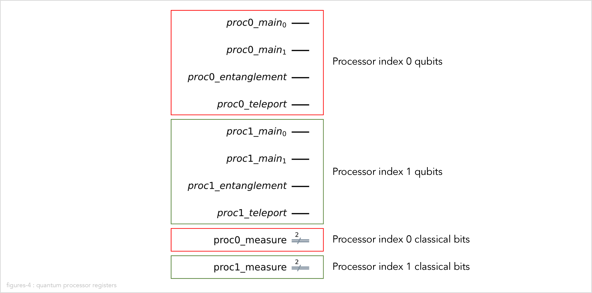
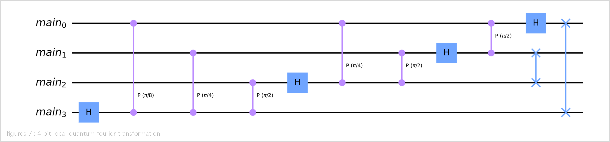

# The distributed quantum Fourier transformation (DQFT) implementation in Qiskit

In this section we describe the implementation of the distributed quantum Fourier transformation
in Qiskit.

## What is Qiskit?

[Qiskit](https://qiskit.org/) is an open-source software development kit (SDK) for working with
quantum computers at the level of pulses, circuits, and application modules.
We use the following two
[elements](https://qiskit.org/documentation/stable/0.24/the_elements.html)
of Qiskit:

-   [Qiskit Terra](https://github.com/Qiskit/qiskit-terra),
    the core component of Qiskit, which contains the building blocks for creating and working with
    quantum circuits, programs, and algorithms.

-   [Qiskit Aer](https://github.com/Qiskit/qiskit-aer)
    which provides high-performance quantum computing simulators with realistic noise models.

## Implementing the quantum Fourier transformation using Qiskit

We implement three different versions of the quantum Fourier transformation (QFT) using Qiskit:

1.  A monolithic (non-distributed) version of the quantum Fourier transformation.
    We use this as a reference to check whether the results of the two distributed versions
    are correct.

2.  A distributed version of the quantum Fourier transformation using teleportation.

3.  A distributed version of the quantum Fourier transformation using cat states.

## Installation instructions

Follow
[these installation instructions](installation.md)
to install our implementation of the quantum Fourier distribution in Qiskit and the
dependencies.

## Directory structure

The [`qiskit`](../qiskit/) subdirectory of this repository contains the implementation of the
distributed quantum Fourier transformation in Qiskit.

There are Python modules that implement abstractions of quantum computers.
The class `MonolithicQuantumComputer` abstracts a monolithic (non-distributed) quantum computer.
The class `ClusteredQuantumComputer` abstracts a clustered (distributed) quantum computer.

These classes are designed in such a way that you can implement a quantum algorithm once, and then
choose to run it on the monolithic or on the clustered quantum computer without any changes to
the a algorithm code.

We have implemented the quantum Fourier transformation algorithm to run on these quantum computers.
However, you can also implement other quantum algorithms to run on these same quantum computer
classes.

| File                | Function                                                                      |
| ------------------- | ----------------------------------------------------------------------------- |
| quantum_computer.py | Implements classes `MonolithicQuantumComputer` and `ClusteredQuantumComputer` |
| utils.py            | Common utilities                                                              |
| examples.py         | Implements examples that are used in the demonstration Jupyter notebooks      |

There are Python modules that implement the three flavors of quantum Fourier transformation:
(1) non-distributed, (2) distributed using teleportation, and (3) distributed using cat states.

The function `create_qft_circuit` creates a quantum circuit that implements the quantum Fourier
transformation on either a monolothic quantum computer or on a clustered quantum computer.
The function takes an argument `computer` which can be either a
`MonolithicQuantumComputer` or a `ClusteredQuantumComputer`.

The class `QFT` represents a monolithic quantum computer that runs the non-distributed version
of the quantum Fourier transformation.

The class `DistributedQFT` represents a clustered quantum computer that runs the distributed version of the
quantum Fourier transformation. The constructor takes a `method` argument which chooses between
using teleportation or cat states for implementing distributed two-qubit controlled-unitary gates.

| File        | Function                                                                             |
| ----------- | ------------------------------------------------------------------------------------ |
| qft.py      | Implements classes `QFT` and `DistributedQFT`, and the function `create_qft_circuit` |
| test_qft.py | Unit tests for `qft.py`                                                              |

There are also Jupyter notebooks to demonstrate the code.

| File                              | Function                                                        |
| --------------------------------- | --------------------------------------------------------------- |
| monolithic_quantum_computer.ipynb | Demonstrates class `MonolithicQuantumComputer`                  |
| clustered_quantum_computer.ipynb  | Demonstrates class `DistributedQuantumComputer`                 |
| qft.ipynb                         | Demonstrates class `QFT`                                        |
| teleport_distributed_qft.ipynb    | Demonstrates class `DistributedQFT` using teleportation         |
| cat_state_distributed_qft.ipynb   | Demonstrates class `DistributedQFT` using cat states            |
| density_matrices.ipynb            | Some basic examples of density matrices                         |
| just_crotz.ipynb                  | Some basic examples of controlled rotation-Z                    |
| find_period.ipynb                 | An example quantum circuit for finding the period of a function |

## Classes that model quantum computers

Python module `quantum_computer.py` defines three classes that model quantum computers:

-   Class `QuantumComputer` is an abstract base class that defines the common interface and
    behavior for the following two types of quantum computers.

-   Class `MonolithicQuantumComputer` models a monolithic (i.e. non-distributed) quantum computer.

-   Class `ClusteredQuantumComputer` models a distributed quantum computer. It is implemented as a
    cluster of processors connected by a entanglement-based quantum network. Each processor in the
    cluster is modeled by the `ProcessorInClusteredQuantumComputer` class.

## Abstract base class `QuantumComputer`

The base class `QuantumComputer` defines the abstract operations that are used to implement a
quantum algorithm. The table below lists the set of operations that is currently supported
(these are all we need for implementing quantum Fourier transformations, but more operations can
easily be added for other algorithms):

| Function              | Description                                                    |
| --------------------- | -------------------------------------------------------------- |
| `hadamard`            | Perform a Hadamard gate on one qubit in the circuit            |
| `controlled_phase`    | Perform a controlled-phase gate on two qubits in the circuit   |
| `swap`                | Perform a swap gate on two qubits in the circuit               |
| `set_input_number`    | Set the input of the circuit to a numeric value                |
| `run`                 | Run the circuit                                                |
| `circuit_diagram`     | Display the circuit diagram                                    |
| `statevector_data`    | Return the circuit output statevector                          |
| `statevector_latex`   | Display the circuit output statevector using LaTeX             |
| `bloch_multivector`   | Display the circuit output state as a Bloch multivector        |
| `density_matrix_city` | Display the circuit output state as a density matrix city plot |

## Class `MonolithicQuantumComputer`

The class `MonolithicQuantumComputer` models a monolithic (i.e. non-distributed) quantum computer.

Under the hood, the implementation of `MonolithicQuantumComputer` does a simple one-to-one mapping
of logical qubits to underlying concrete qubits.

Create an instance of a monolithic quantum computer:

```python
computer = MonolithicQuantumComputer(total_nr_qubits)
```

Add a few gates to the circuit:

```python
computer.hadamard(0)
computer.controlled_phase(pi/8, 0, 1)
computer.controlled_phase(pi/4, 0, 2)
computer.swap(0, 3)
```

Run the circuit with input value 5 (binary 0101):

```python
computer.run(input_number=5)
```

Display the circuit. Here we can see that the operations on the logical qubits are mapped one-to-one
to operations on the underlying concrete qubits:

```python
computer.circuit_diagram(with_input=True)
```


Display the output density matrix of the circuit as a city plot:

```python
computer.density_matrix_city()
```


The Jupyter notebook `monolithic_quantum_computer.ipynb` contains a more detailed example
of how to use the class `MonolithicQuantumComputer`.

## Class `ClusteredQuantumComputer`

The class `ClusteredQuantumComputer` models a clustered (i.e. distributed) quantum computer that
consists of multiple processors connected by an entanglement-based quantum interconnect.

To the quantum algorithms running on the computer, the class `ClusteredQuantumComputer` provides the
illusion that the clustered quantum computer has a uniform set of global qubits, indexed 0 thru
`total_nr_qubits`-1.

The algorithm can perform a single-qubit gate on any global qubit and a two-qubit gate on any pair
of global qubits, without needing to worry whether those two qubits are located on the same or on
different processors.

The `ClusteredQuantumComputer` constructor takes the following arguments:

-   `nr_processors`: The number of quantum processors in the cluster.

-   `total_nr_qubits`: The total number of qubits in the cluster. This must be a multiple of
    `nr_processors` so that the qubits can be evenly divided across the processors.

-   `method`: The method that is used to implement distributed controlled-unitary gates, either
    `Method.TELEPORT` or `Method.CAT_STATE`

The following example creates a clustered quantum computer and defines an example circuit with some
single-qubit and two-qubit gates.

```python
nr_processors = 2
total_nr_qubits = 4
method = Method.TELEPORT
computer = ClusteredQuantumComputer(nr_processors, total_nr_qubits, method)

computer.hadamard(0)
computer.controlled_phase(pi/8, 0, 1)
computer.controlled_phase(pi/4, 0, 2)
computer.swap(0, 3)
```

Note that we used the exact same function calls to create the circuit as in the example for
the monolithic quantum computer above.
In other words, you can write a quantum algorithm once and run it either on a monolithic or
distributed quantum computer without making any change to the code.

Under the hood, each processor in the cluster is modeled by a `_ProcessorInClusteredQuantumComputer`
object. Note that the class name starts with an underscore; it is a private class used internally
in the implementation that is not intended to be used by algorithm developers.

The processors are indexed 0 thru `nr_processors`-1.

Each processor has a set of local qubits, indexed 0 thru `nr_qubits_per_processor`-1
where `nr_qubits_per_processor` = `total_nr_qubits` / `nr_processors`.

It is very easy to map a global qubit index to a combination of a processor index and a local
qubit index:

```python
processor_index = global_qubit_index // nr_qubits_per_processor
local_qubit_index = global_qubit_index % nr_qubits_per_processor
```

When the `ClusteredQuantumComputer` is asked to perform a single qubit gate on a global qubit,
it simply maps the global qubit index to a processor index and a local qubit index on that
processor, and then executes the single qubit gate on that local qubit.

In the following example, we can see that global qubit index 2 is mapped to processor index 1
and local qubit index 0 (we have deleted some details from the circuit diagram that will be
explained later):

```python
computer = ClusteredQuantumComputer(nr_processors=2, total_nr_qubits=4, method=Method.TELEPORT)
computer.hadamard(2)
computer.circuit_diagram()
```


Things get more interesting when the `ClusteredQuantumComputer` is asked to perform a two-qubit
gate.

First, clustered quantum computer maps the global qubit index of each involved qubit to a processor
index and a local qubit index.

If both qubits happen to be mapped to the same processor, the clustered quantum computer simply
executes the two qubit gate locally on that processor.

In the following example, we perform a controlled-phase operation between global qubits 2 and 3.
These happen to be located on the same processor, so we can perform the gate locally on that
processor.

```python
computer = ClusteredQuantumComputer(nr_processors=2, total_nr_qubits=4, method=Method.TELEPORT)
computer.controlled_phase(pi/4, 2, 3)
computer.circuit_diagram()
```


If the two qubits are not located on the same processor, the clustered quantum computer implements
the two qubit gate in a distributed manner.

For controlled-unitary gates (of which controlled-phase is an example), there are two different
methods for implementing the gate in a distributed manner:

-   Using **teleportation**:

    -   Teleport one qubit, so that both qubits are located on the same processor.
    -   Perform the two qubit gate locally on that processor.
    -   Teleport the qubit back to its original processor.

-   Using **cat states**:

    -   Perform a cat-entangle operation to create an additional entangled control qubit on the same
        processor as the target qubit.
    -   Perform the two qubit gate locally on that processor.
    -   Perform a cat-disentangle operation to disentangle the additional control qubit.

For two qubit gates which are not controlled-unitary gates (e.g. a swap gate) we always use
the teleportation method.

The implementation of teleportation and cat states requires some extra ancillary qubits and some
classical bits to implement the communication between the processors across the quantum
interconnect.

Up until now, we have omitted these ancillary quantum qubits and classical bits from the circuit
diagrams. In the following example, we show the complete circuit diagram.

```python
computer = ClusteredQuantumComputer(nr_processors=2, total_nr_qubits=4, method=Method.TELEPORT)
computer.circuit_diagram()
```



In the above circuit we have the following qubits and classical bits:

-   The **main** qubits store the state for the quantum algorithm.
    There are four main qubits in total, with global indexes 0 thru 3.
    Each processor has two main qubits, with local indexes 0 thru 1.

-   The **ancillary** qubits are used for quantum communication between the processors:

    -   The **entanglement** qubit holds one half of an entanglement with another processor.
        The entanglement is used to teleport another qubit or to entangle a cat state.

    -   The **teleport** qubit is used to temporarily store the sent or received qubit during
        teleportation.

-   The classical **measurement** bits are used to measured classical bits during teleportation,
    cat state entanglement, or cat state dis-entanglement.

In the following example, we use the teleportation method to implement a controlled-phase gate
between qubits 0 and 3, which are located on different processors.

```python
computer = ClusteredQuantumComputer(nr_processors=2, total_nr_qubits=4, method=Method.TELEPORT)
computer.controlled_phase(pi/4, 0, 3)
computer.circuit_diagram()
```

Although, we only asked for a single controlled-phase gate, the circuit that the clustered
quantum computer generates is quite complex:


We can understand what is happening by breaking the circuit down into five steps:

-   _Step 1_: Swap the control qubit for the controlled-phase gate (proc0_main0) into the teleport
    on processor 0 (proc0_teleport) in preparation for teleporting it to processor 1.

-   _Step 2_: Teleport a qubit from processor 0 to processor 1 (proc0_teleport to proc1_teleport).
    Teleportation is implemented using the following sub-steps:

    -   Create an entanglement (a |ɸ+> Bell state to be precise) between qubits proc0_entanglement
        and proc1_entanglement using a Hadamard and a controlled-NOT gate.

    -   Perform two measurements on processor 0, and store the results in the proc0_measure
        classical register.

    -   Use the classical measurement results, to perform X and Z corrections on processor 1.
        Note: in the Qiskit simulation, we don't model sending of classical messages between
        processors. In the QNE-ADK simulation, we do.

    -   Swap proc0_entanglement into proc0_teleport.

-   _Step 3_: Perform the controlled-phase gate locally on processor 1, using the teleport qubit
    proc1_teleport as the control gate, and proc1_main1 as the target gate.

-   _Step 4_: Teleport the control gate proc1_teleport on processor 1 back to proc0_teleport on
    processor 0. The steps are similar to step 2 above.

-   _Step 5_: Teleport the control gate from proc0_teleport back into proc0_main0.

Note that the steps are not optimal because the implementation uses teleportation as a subroutine.
For example, the very last two swaps could be combined into a single swap.
We don't attempt these optimizations in cluster computer circuit generator, because the underlying
circuit compilers in Qiskit are quite good at these kinds of optimizations.

In the following example, we use the cat state method instead of the teleportation method to
implement a controlled-phase gate between qubits 0 and 3:

```python
computer = ClusteredQuantumComputer(nr_processors=2, total_nr_qubits=4, method=Method.CAT_STATE)
computer.controlled_phase(pi/4, 0, 3)
computer.circuit_diagram()
```


When using the cat state method to implement the distributed controlled-phase gate, we have
three steps:

-   _Step 1_: Do a cat-entanglement operation to entangle qubit proc1_entangle on processor 1 with
    the original control qubit proc0_main0 on processor 0.

-   _Step 2_: Perform the controlled-phase gate locally on processor 0 between the entangled
    control qubit proc1_entangle and the original target qubit proc1_main1.

-   _Step 3_: Do a cat-disentangle operation to disentangle the original control qubit proc0_main0.

As you can see, the cat state method is simpler than the teleportation method. However, we can
only use if for controlled-unitary two qubit gates.

## The quantum Fourier transformation algorithm

The function `make_qft_circuit` in Python module `qft.py` is responsible for generating the circuit
to implement a quantum Fourier transformation.

The algorithm is essentially the same as the one presented in the
[quantum Fourier transformation chapter in the Qiskit textbook](https://qiskit.org/textbook/ch-algorithms/quantum-fourier-transform.html)
and it is simple enough to show the complete source code here:

```python
def create_qft_circuit(computer, final_swaps=True):
    _create_qft_circuit_rotations(computer, computer.total_nr_qubits)
    if final_swaps:
        _create_qft_circuit_final_swaps(computer)

def _create_qft_circuit_rotations(computer, remaining_nr_qubits):
    if remaining_nr_qubits == 0:
        return
    remaining_nr_qubits -= 1
    computer.hadamard(remaining_nr_qubits)
    for qubit in range(remaining_nr_qubits):
        computer.controlled_phase(pi / 2 ** (remaining_nr_qubits - qubit), qubit, remaining_nr_qubits)
    _create_qft_circuit_rotations(computer, remaining_nr_qubits)

def _create_qft_circuit_final_swaps(computer):
    for qubit in range(computer.total_nr_qubits // 2):
        computer.swap(qubit, computer.total_nr_qubits - qubit - 1)
```

The `create_qft_circuit` does not know or care whether it is generating the circuit for a
monolithic quantum computer or for a distributed quantum computer:

-   If the `computer` argument is a `MonolithicQuantumComputer` object, the circuit will be
    generated for a monolithic quantum computer.

-   If the `computer` argument is a `ClusteredQuantumComputer` object, the circuit will be generated
    for a clustered quantum computer. All necessary teleportations and/or cat states will
    automatically be generated under the hood.

## The monolithic (non-distributed) quantum Fourier transformation

The class `QFT` is a convenience class which represents the quantum Fourier transform running
on a monolithic (non-distributed) quantum computer.

The implementation is trivial:

```python
class QFT(MonolithicQuantumComputer):

    def __init__(self, total_nr_qubits, final_swaps=True):
        MonolithicQuantumComputer.__init__(self, total_nr_qubits)
        create_qft_circuit(self, final_swaps)
```

In the following example, we create a 4-qubit QFT, run it with input value 3, and show the result
as Bloch spheres:

```python
qft = QFT(total_nr_qubits=4, final_swaps=True)
qft.run(input_number=3)
qft.circuit_diagram()
```



```python
qft.bloch_multivector()
```


## The clustered (distributed) quantum Fourier transformation

The class `DistributedQFT` is a convenience class which represents the quantum Fourier transform running
on a clustered (distributed) quantum computer.

Once again, the implementation is trivial. Note that this implementation uses the exact same
`create_qft_circuit` function as the monolithic implementation:

```python
class DistributedQFT(ClusteredQuantumComputer):

    def __init__(self, nr_processors, total_nr_qubits, method, final_swaps=True):
        ClusteredQuantumComputer.__init__(self, nr_processors, total_nr_qubits, method)
        create_qft_circuit(self, final_swaps)

```

In the following example, we create a 4-qubit DistributedQFT using the teleport method, run it
with input value 3, and show the result as Bloch spheres:

```python
qft = DistributedQFT(nr_processors=2, total_nr_qubits=4, method=Method.TELEPORT)
qft.run(input_number=3)
qft.circuit_diagram()
```


```python
qft.bloch_multivector()
```


## Testing the correctness of the distributed quantum Fourier implementation

If you paid close attention you may have noticed that the Bloch spheres produced by the
`QFT` class are identical to the Bloch spheres produced by the `DistributedQFT` class.

This is a good thing! It means that the non-distributed and distributed implementation of the
quantum Fourier transformation produce the same output states given the same input states.

If we had displayed the state vectors instead of the Bloch spheres, this would be less obvious
because the state vectors produced by non-distributed and distributed implementation differ
by a global phase factor which can be ignored.

The file `test_qft.py` contains a Pytest automated unit test which tests the correctness of
our `DistributedQFT` class. There are several test cases, but the most important test case
is `test_dqft_same_as_qft`. It runs the distributed quantum Fourier transformation for various
numbers of qubits, various methods, and various input values. For each run, it checks whether
the state vector produced by the distributed QFT is the same as the state vector produced by the
non-distributed QFT for the same input value. It uses utility function `state_vectors_are_same`
which ignores global phase differences and rounding errors when comparing state vectors.

```python
def test_dqft_same_as_qft():
    nr_processors = 2
    test_cases = [
        (Method.TELEPORT, 2, 2, 0),
        (Method.TELEPORT, 2, 2, 1),
        (Method.TELEPORT, 2, 4, 0),
        (Method.TELEPORT, 2, 4, 3),
        (Method.TELEPORT, 2, 4, 12),
        (Method.TELEPORT, 2, 4, 15),
        (Method.TELEPORT, 2, 6, 3),
        (Method.TELEPORT, 3, 6, 11),
        (Method.CAT_STATE, 2, 4, 9),
    ]
    for method, nr_processors, total_nr_qubits, input_number in test_cases:
        qft = QFT(total_nr_qubits)
        qft.run(input_number)
        qft_statevector = qft.main_statevector()
        dqft = DistributedQFT(nr_processors, total_nr_qubits, method)
        dqft.run(input_number)
        dqft_statevector = qft.main_statevector()
        assert state_vectors_are_same(qft_statevector, dqft_statevector)
```

Running the unit tests indicates that our distributed QFT implementation does indeed produce the
correct output states:

<pre>
$ <b>pytest -v .</b>
================================= test session starts ==================================
platform darwin -- Python 3.8.14, pytest-7.2.0, pluggy-1.0.0 -- /Users/brunorijsman/git-personal/quantum-internet-hackathon-2022/venv/bin/python3.8
cachedir: .pytest_cache
rootdir: /Users/brunorijsman/git-personal/quantum-internet-hackathon-2022/qiskit
collected 4 items

test_qft.py::test_monolithic_qft_one_qubit PASSED                                [ 25%]
test_qft.py::test_monolithic_qft_two_qubits PASSED                               [ 50%]
test_qft.py::test_monolithic_qft_four_qubits PASSED                              [ 75%]
test_qft.py::test_dqft_same_as_qft PASSED                                        [100%]

================================== 4 passed in 2.18s ===================================
</pre>
